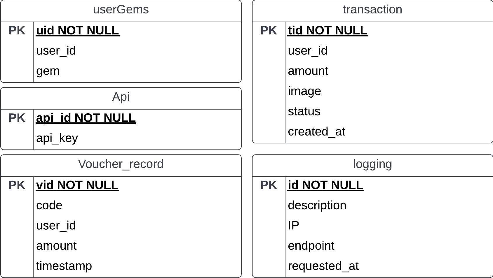

# Soap Service for Toco

## Introduction
Toco-soap is a soap service for Toco. It is a simple service that allows toco to communicate with other systems using soap. It is built using the Jax-ws library and build using maven. This service is built to complete IF3110 assignment.

## Features Overview
  - [x] manage user gems
  - [x] manage user transaction
  - [x] voucher usage logging
  - [x] request logging

## Installation
there are 2 ways that you can run this server
1. using maven
- make sure you have maven installed
- run `mvn clean install`
- run `mvn exec:java`
- the server will run on port 8080

2. using docker
- make sure you have docker installed
- run `docker compose build`
- run `docker compose up`
- the server will run on port 8080

## Database Schema
Toco soap service uses 5 tables in the database, the tables are `userGems`, `transaction`, `voucher_record`, `api`, and `logging` . The schema for the tables are as follows

## Endpoints
all of the endpoints are in /service 
- addGems -> add gems to user
- getGems -> get user gems
- createTransaction -> create a transaction from a user
- getTransactions -> get all transactions from a user
- useVoucher -> use a voucher
- getSpecifiedVouchers -> get the specified voucher usage
- getAllVouchers -> get all voucher usage

